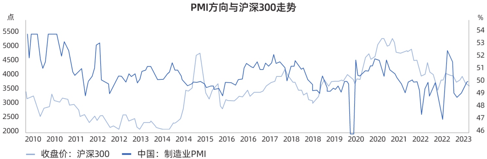
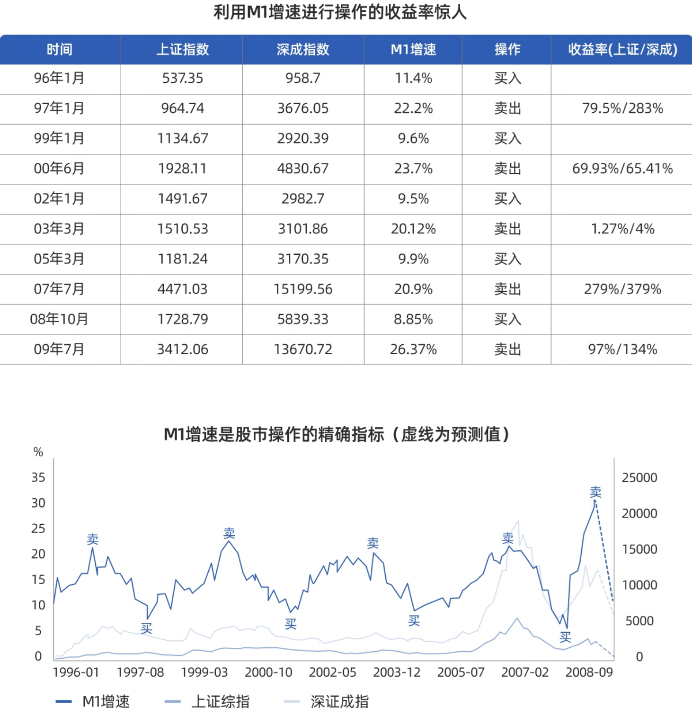
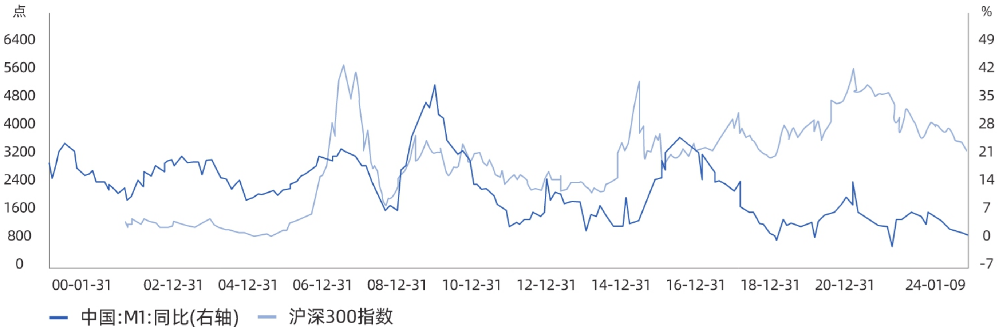
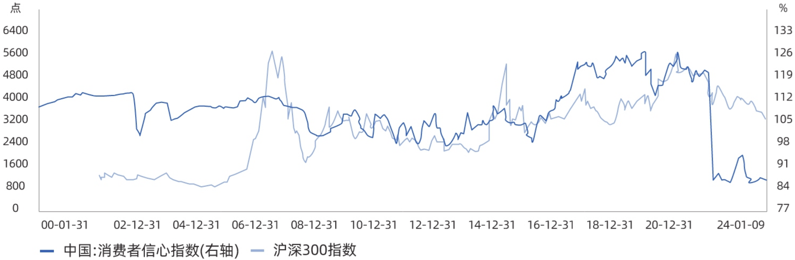
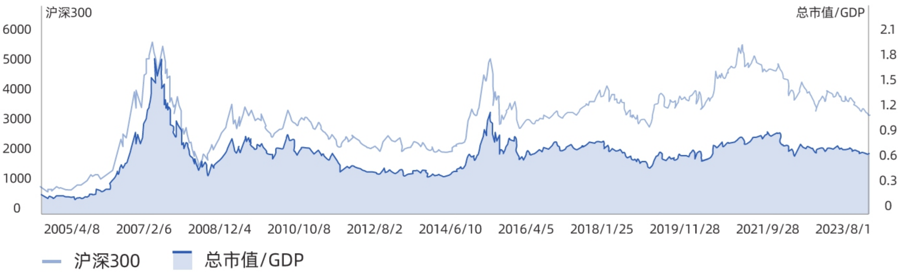

# 雪球股票投资24章

[toc]

## 一、搞懂这些先行指标，提前读懂牛熊周期

先行指标总是比宏观经济更早地发生转折，提前于经济周期到达高峰或低谷。

### 1. 这些指标洞察经济增长

#### 1.1 PMI看景气

意思是采购经理指数，经常用来反映经济的变化趋势。

通常官方PMI数值会由国家统计局在每月的最后一天公布，这个数值以50为荣枯分水线。 **当PMI大于50时，说明经济在扩张，数值越高表明扩张速度越快；当PMI小于50时，说明经济在收缩，数值越低表明收缩速度越快。**

值得注意的是，日常生活中除了官方的PMI，我们经常能够看到一个非官方的PMI-财新PMI。

这两者最重要的区别在于调查样本的偏向不同，官方调查样本中大企业、国企更多，所以数值所反映的信息更能体现大企业、国企的经济景气程度。而财新PMI调查样本偏中小企业、民企，所以数值所反映的信息比较偏向于中小企业和民企。

为什么PMI会是先行指标？这与统计方法有关，PMI的数据来自于一线人员第一时间对企业运行的判断，正所谓春江水暖鸭先知。再加上PMI的频率是月度发布，而GDP大都是季度发布。所以PMI指数不仅与经济走势密切相关，而且通常会小幅领先于GDP指标。

PMI与股市的关联度如何？历史上看除了2014年开始的杠杠牛外，沪深300的中期趋势与PMI紧密相连。下图不难看出，2016年PMI指数阶段触底，A股也走到了行情的最低点，接着PMI一路扩张，A股也随之上涨。等到2020年开始PMI开始一路走低，沪深300随后在2021年见顶后快速回落。

基于此我们可以得出简单结论， **PMI持续扩张对股市利好；PMI持续收缩对股市利空。**


<center>2010年至2023年，PMI方向与沪深走势对比</center>

#### 1.2 M1定买卖

已知M1=M0（流通中现金）+企事业单位存款，在M0不变的情况下，若M1大幅增加，意味着企业将赚到的现金变成存款，也就是说企业家们对于未来的预期比较悲观，开始停止或者减少扩张。反之M1大幅减少，意味着企业将赚到的现金以及存款全部花出去，这时企业家往往对未来很乐观，重新开始扩张。

在2009年之前，中国M1增速大概维持在10%—20%的区间内，10%意味着阶段低位，20%意味着阶段高位。

当时招商证券的罗毅写过一篇非常著名的研报，提出了“M1定买卖”的说法。逻辑在于M1高位代表企业家信心处于低位，往往意味着股市和经济的顶部。他明确提出 **当M1增速接近10%时买入，增速超过20%时卖出** ，同时辅以深圳成指回测，1996年至2009年累计收益率达到惊人的9400%。


<p style="text-align:center;">1996年至2008年，根据M1增速交易回测</p>

在2011年以后，中国经济增速告别了双位数增长，和GDP直接挂钩的M1值波动区间也从10%—20%变为5%—10%。因此不能刻舟求剑仍以10%和20%作为买入卖出信号，现在如果以 **M1同比增速下降触及5%的低位水平为买入信号，上升触及10%的高位水平为卖出信号更为合理** 。

如果将2000年至今M1增速与万得全A走势对比如下，可以看到除了2015年因为棚改货币化安置导致M1定买卖法则失效之外，其它M1增速还是很好的预测股市的指标。


<center>2000年以来中国M1与沪深300关系图</center>

#### 1.3 信心指数读人心

如果说PMI是制造业的先行指标，消费者信心指数（Consumer Confidence）则是一个反映消费信心强弱的指标，它综合反映了消费者对当前经济状况的评价、对未来经济前景的预期、收入水平、收入预期以及消费心理状态的主观感受。

1997年12月，中国国家统计局开始编制中国消费者信心指数，该指数对于预测经济走势和消费趋向有一定前瞻性，取值范围在0至200之间，其中100代表中性态度，指数值小于100表示悲观态度，而大于100则表示乐观态度。


<center>2000年至2024年信心指数与沪深300指数对比图</center>

历史上看消费者信心指数与A股之间有很强的相关性，当消费者对经济前景持乐观态度时，他们更可能增加消费，从而推动经济增长。这种经济增长的预期可能会提振股市，使得A股上涨。

2016年以来消费者信心指数开始上涨并突破100，随后维持高位一直到2021年，对应的是整个大消费股的业绩爆棚、估值崛起，沪深300迎来了持续的上涨。

相反，如果消费者对经济前景持悲观态度，他们可能会减少消费，这可能会导致经济增长放缓，进而影响A股市场的表现。

值得注意的是，消费者信心指数每个月披露一次，我们需要观察的并不是单次的数值，而是一个整体趋势，如果连续几个月发现信心指数走出趋势，很可能是要“变天”了。


### 2. 这些指标判断估值水平

估值永远都是一个相对概念，没有绝对的估值高低和好坏，我们该如何衡量估值水平？以下三个维度，会让你对A股估值有一个全方位认识。

#### 2.1 对比经济总量-巴菲特指标

投资大师沃伦·巴菲特有一个著名的论断：如果只选择一个指标，来判断任何时刻市场的估值水平，那么股市总市值与GDP之比可能是最好的指标，这个指标也被称为巴菲特指标。

巴菲特认为，若两者之间的比率处于70%左右时买进股票，就会有不错的收益，而当股票市值超过了100%，就比较危险了。

我们用A股数据看看真实情况是否如此，考虑到2007年之前，上市的股票数量太少，好多超级龙头都没上市。所以，我们只看2008年之后的数据。

先看几次历史底部，2008年底部时A股的巴菲特指标大概在46%，2013年钱荒底时大概在43%，2018年年底时巴菲特指标在53%左右。

反观几次大顶，2007年牛市顶点时A股巴菲特指标直接冲到了180%！2015年水牛行情里，巴菲特指标到达了120%，2021年核心资产行情里巴菲特指标再度触及100%。

由此看来，用巴菲特来判断A股整体估值历史上长期有效。但同时也需要注意，过去20年来，巴菲特指标的底部不断抬高。还是那个道理，没有一个具体的数字能够代表绝对底部，更没有一个办法能精准抄底，能抓住相对估值低位布局入场就已经能战胜大多数人了。


<center>2005年至2023年巴菲特指标与沪深300对比图</center>

#### 2.2 对比不同资产-股债性价比

单看股市估值而不考虑资金成本，那就是还没入门。股债性价比，顾名思义就是判断股票和债券在某个时间点哪个更具投资性价比。所以，这个指标需要用到两个数据：分别来自股市和债市。

参考传统的股债利差模型，结合雪球投研团队大量数据验证分析，我们编制了雪球股债性价比指数：

> 第一个数据来自于股市，也就是股票的平均预期收益率，我们用中证全指PE倒数来表示。
>
> 第二个数据来自于债市，使用的是十年期国债收益率，十年期国债收益率看成是长期债市的基准利率，决定着整个债市的走向。

``` bash
股债利差 = 10年期国债收益率 - 中证全指数PE倒数
```

**最终得出的指数数值越低，则意味着股票类资产性价比越高。**


